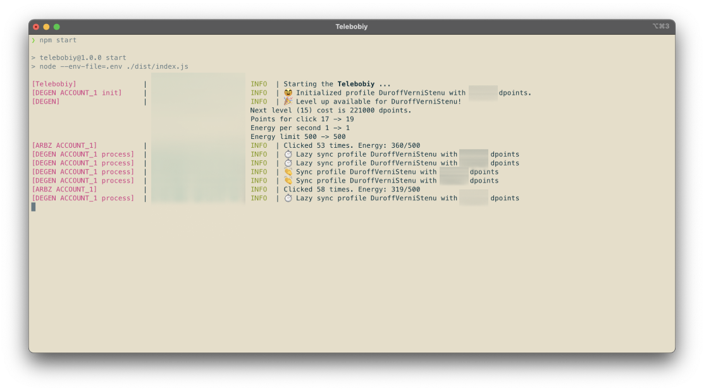

# Telebobiy



Telebobiy is a powerful, user-friendly tool designed to claim and mine rewards from various Telegram apps. With support for popular applications like ClickArbuz and Degenerative, it's your one-stop solution for Telegram app mining.

### Disclaimer

While Telebobiy is designed to automate the process of claiming and mining rewards, it's important to note that using such tools may violate the terms of service of the supported applications. Users are responsible for their own actions while using Telebobiy. The developers of Telebobiy are not responsible for any bans or penalties users may receive while using the tool.

## Supported telegram projects

Currently, the application supports claim/mine operations for the following projects:

- clickarbuz
- [Degenerative](https://degenerative.space/)

## Related Projects

You might also be interested in these other projects:

- [PocketFiBot](https://github.com/AlexMubarakshin/PocketFiBot): Zero cost PocketFi claimer executed in GithubActions
- [ClickARBUZBot](https://github.com/AlexMubarakshin/ClickARBUZBot): Autoclicker script for ClickARBUZ. The logic used in this project was also used in Telebobiy.

## Installation

Follow these simple steps to get Telebobiy up and running:

1. Clone the repo

   ```bash
   git clone https://github.com/AlexMubarakshin/Telebobiy.git
   ```

2. Navigate to the project directory:
   ```bash
   cd ./Telebobiy
   ```
3. Install the dependencies:
   ```bash
   npm install
   ```
4. Create `.env` file

   ```bash
   cp ./.env.example ./.env
   ```

5. Build the application
   ```bash
   npm run build
   ```

## Configuration

To configure the application, you need to modify the `.env` file. Here are the environment variables you can set:

- `CONFIG_LOGGER_COLOR_MODE`: (Optional) This sets the color mode for the logger. Use `DARK` for dark terminal backgrounds and `LIGHT` for light terminal backgrounds. (Default DARK)

- `PROVIDER_ARBUZ_ACCOUNT_1_RAW_DATA`: This is the token extracted from the `X-Telegram-Init-Data` header. You can get this token by using the Telegram web version and inspecting the network tab in your browser's developer tools.
- `PROVIDER_ARBUZ_ACCOUNT_1_USER_AGENT`: (Optional) This is the user agent for the ClickArbuz account. If not provided, a default user agent will be used.
- `PROVIDER_ARBUZ_ACCOUNT_1_INTERVALS_SECONDS`: (Optional) This is the interval in seconds for the ClickArbuz account. If not provided, a default interval will be used.

- `PROVIDER_DEGENERATIVE_ACCOUNT_1_RAW_DATA`: This is the token extracted from the `x-init-data` header. You can get this token by using the Telegram web version and inspecting the network tab in your browser's developer tools.
- `PROVIDER_DEGENERATIVE_ACCOUNT_1_USER_AGENT`: (Optional) This is the user agent for the Degenerative account. If not provided, a default user agent will be used.
- `PROVIDER_DEGENERATIVE_ACCOUNT_1_INTERVALS_SECONDS`: (Optional) This is the interval in seconds for the Degenerative account. If not provided, a default interval will be used.

## Usage

1. Edit .env

2. Start the applciaiton
   ```bash
   npm start
   ```

## Code Structure

The main entry point of the application is `src/index.ts`. The application uses providers defined in `src/providers` to interact with the supported applications. Each provider has its own implementation in the `impl` directory.

## ❤️ Donate

If you find Telebobiy useful and want to support its development, consider making a donation:

- BTC: `bc1qda0kujx6a4f7nsds660e09j8hqgp4fe6xq0acj`

- ETH: `0x75aB5a3310B7A00ac4C82AC83e0A59538CA35fEE`
